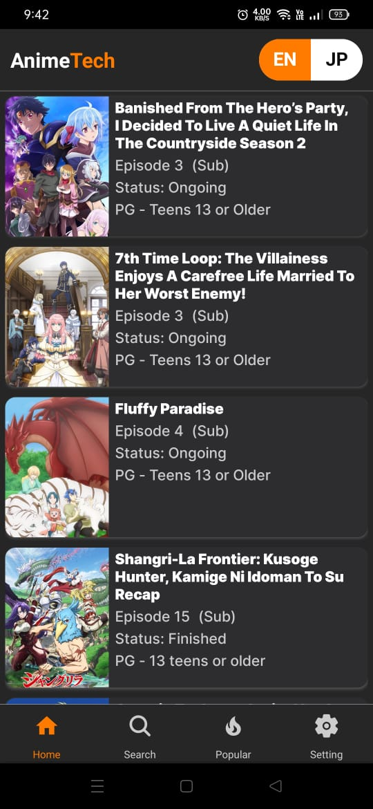
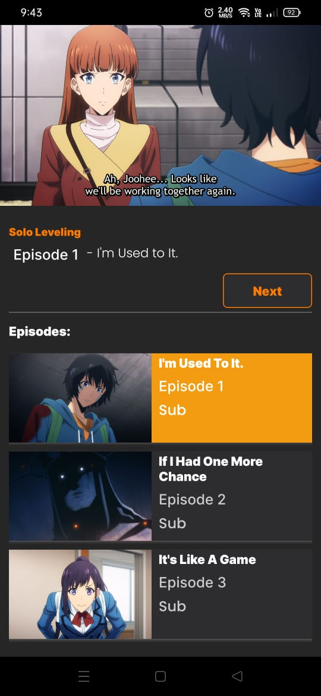
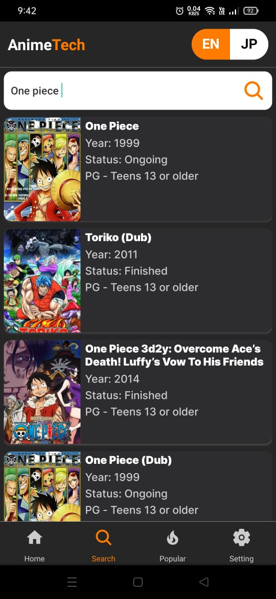
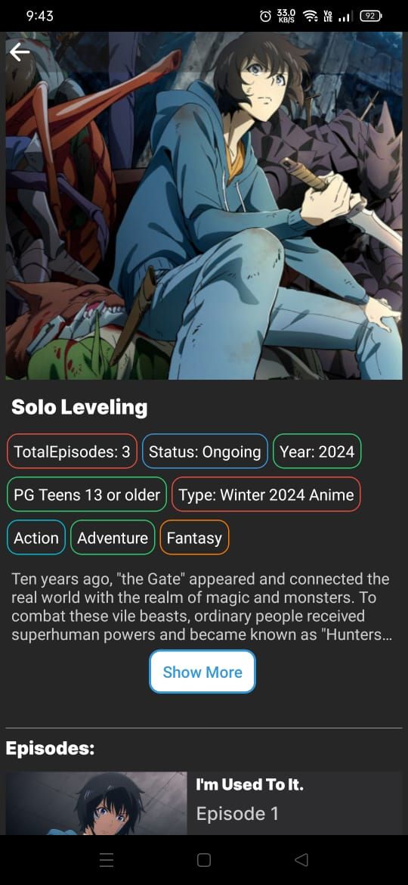
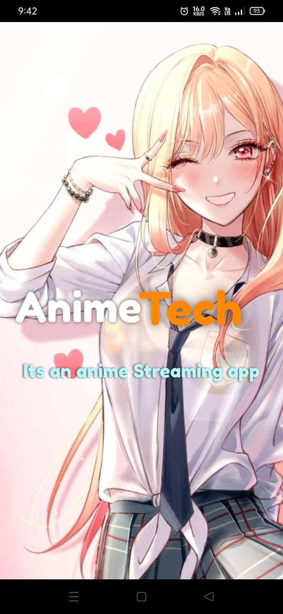
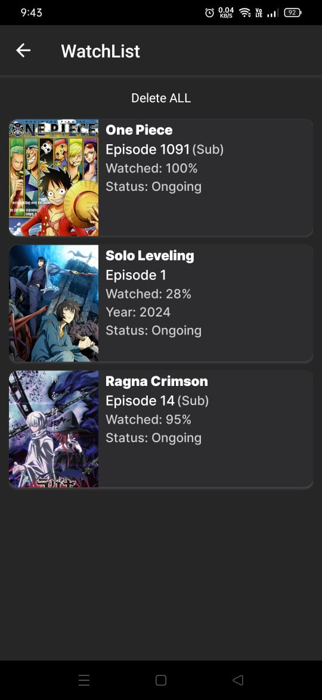

<div align="center">
  
  <h2 align="center">AnimeTech APP (Android)</h2>

  


  AnimeTech is fully responsive Anime Streaming APP,it made by using anime api, 
  <br />Responsive for all devices, built using React Native and Node.js for api.
  <br />Aswell have as some basic animations.
  <br />Custom Video Player with quality change options.
  <br />find out more while using the app.
  <li align="center">Responsive design</li>

  <a href="https://github.com/Tech2cool/AnimeTechAPP/tree/main/BUILD_APK"><strong>Working the APK</strong></a>

</div>

<br />

# Getting Started

>**Note**: Make sure you have completed the [React Native - Environment Setup](https://reactnative.dev/docs/environment-setup) instructions till "Creating a new application" step, before proceeding.

## Step 1: Start the Metro Server

First, you will need to start **Metro**, the JavaScript _bundler_ that ships _with_ React Native.

To start Metro, run the following command from the _root_ of your React Native project:


```bash
# using npm
npm install 
# to start application with metro terminal (recommended)
npm start

# OR using Yarn
yarn add
# to start application with metro terminal (recommended)
yarn start
```
### Demo Screeshots
### Home 

### Video 


### Search 


### Anime Info 


### APP SplashScreen 



### Watchlist 
